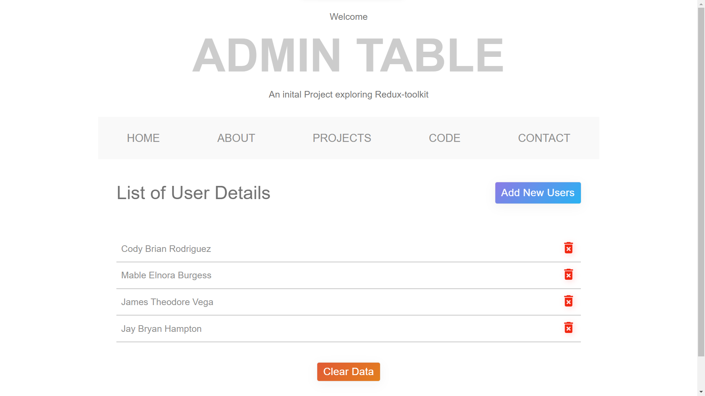

# Welcome to Mini-project-4 (Project - Redux-toolkit)

<h3>This is a mini-project. The purpose to make this is for practicing & understand deeply about <b>Redux-toolkit</b> & <b>styled components</b>.
</h3>

# Deployed URL 👉 [Click here](https://redux-toolkit-dusky.vercel.app/)

- Rushi Joshi   (My Linkedin profile :- https://www.linkedin.com/in/rushijoshi3798/)  
  (My Portfolio :- https://rushijoshi3798.github.io/)
   
- Source Code(GitHub link):- https://github.com/Rushijoshi3798/Project-redux-toolkit

## Home page :

## Show your support

Give a ⭐️ if you like this project!

### Thank you
